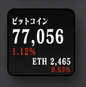

# Crypto Watcher for UlanziDeck

<p align="center">
  
</p>

Shows live [Bitcoin](https://coinmarketcap.com/currencies/bitcoin/) and [Ethereum](https://coinmarketcap.com/currencies/ethereum/) prices on an [UlanziDeck](https://www.ulanzi.com/) key.

Prices and 24h change come from [CoinMarketCap](https://coinmarketcap.com/). The key uses a dark ticker layout:

- **Top:** symbol (or `ビットコイン` when BTC and ETH are both on)
- **Middle:** price
- **Bottom:** 24h change percent (green up, red down — no `+` / `-`)

Tap the key to refresh immediately.

For the same typeface as the Futu portfolio key, install **FOT-Matisse Pro EB** on the machine running UlanziDeck.

## Install

1. Clone this repo into your UlanziDeck `Plugins` folder as `com.raykira.cryptowatcher.ulanziPlugin`, or copy that folder there.
2. Restart UlanziDeck.
3. Add **Crypto Watcher** to a key.

Default plugin path on macOS:

```text
~/Library/Application Support/Ulanzi/UlanziDeck/Plugins/com.raykira.cryptowatcher.ulanziPlugin
```

### Settings

- Show Bitcoin (BTC)
- Show Ethereum (ETH)
- Refresh interval (default 1 minute)

You can show BTC only, ETH only, or both on one key.
